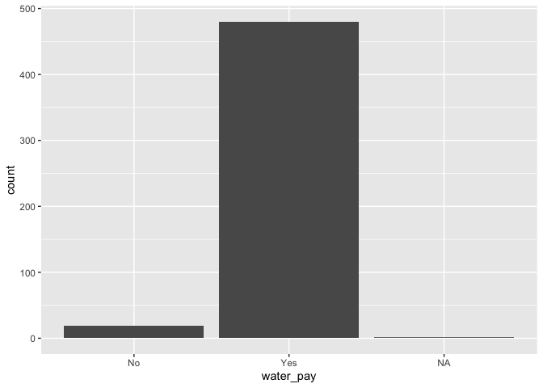

<!-- README.md is generated from README.Rmd. Please edit that file -->

# chckapmalawi

<!-- badges: start -->
<!-- badges: end -->

The goal of chckapmalawi is to …

## Installation

You can install the development version of chckapmalawi from
[GitHub](https://github.com/) with:

``` r
# install.packages("devtools")
devtools::install_github("openwashdata/chckapmalawi")
```

## Example

This is a basic example which shows you how to solve a common problem:

``` r
library(chckapmalawi)
library(tidyverse)
#> Warning: package 'lubridate' was built under R version 4.3.1
#> ── Attaching core tidyverse packages ──────────────────────── tidyverse 2.0.0 ──
#> ✔ dplyr     1.1.3     ✔ readr     2.1.4
#> ✔ forcats   1.0.0     ✔ stringr   1.5.0
#> ✔ ggplot2   3.4.2     ✔ tibble    3.2.1
#> ✔ lubridate 1.9.3     ✔ tidyr     1.3.0
#> ✔ purrr     1.0.2     
#> ── Conflicts ────────────────────────────────────────── tidyverse_conflicts() ──
#> ✖ dplyr::filter() masks stats::filter()
#> ✖ dplyr::lag()    masks stats::lag()
#> ℹ Use the conflicted package (<http://conflicted.r-lib.org/>) to force all conflicts to become errors
## basic example code
```

``` r
chckapmalawi |> 
  count(water_pay)
#> # A tibble: 3 × 2
#>   water_pay     n
#>   <chr>     <int>
#> 1 No           19
#> 2 Yes         480
#> 3 <NA>          1
```

``` r

chckapmalawi |> 
  ggplot(aes(x = water_pay)) +
  geom_bar()
```


