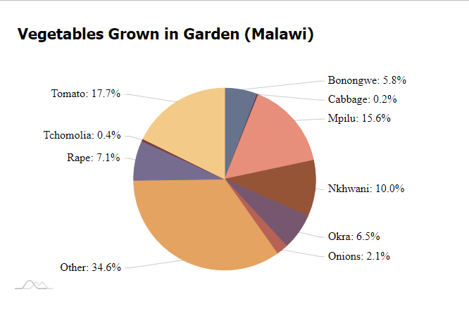

<!-- README.md is generated from README.Rmd. Please edit that file -->

# chckapmalawi

<!-- badges: start -->

[](https://zenodo.org/doi/10.5281/zenodo.10459432)
[](https://github.com/openwashdata/chckapmalawi/actions/workflows/R-CMD-check.yaml)
<!-- badges: end -->

This packages compiles insights from a Knowledge, Attitudes, and
Practices (KAP) Survey conducted by [BASEflow](https://baseflowmw.org/)
for Waste Advisers in Malawi, focusing on Community Health Centers
(CHCs).

## Installation

You can install the development version of chckapmalawi from
[GitHub](https://github.com/) with:

``` r
# install.packages("devtools")
devtools::install_github("openwashdata/chckapmalawi")
```

Alternatively, you can download the individual dataset as a CSV or XLSX
file from the table below.

| dataset      | CSV                                                                                                 | XLSX                                                                                                  |
|:-------------|:----------------------------------------------------------------------------------------------------|:------------------------------------------------------------------------------------------------------|
| chckapmalawi | [Download CSV](https://github.com/openwashdata/chckapmalawi/raw/main/inst/extdata/chckapmalawi.csv) | [Download XLSX](https://github.com/openwashdata/chckapmalawi/raw/main/inst/extdata/chckapmalawi.xlsx) |

## Project goal

## Data

The data set covers diverse aspects including household demographics,
CHC membership, water sources, sanitation, nutrition knowledge, hygiene
practices, and environmental conditions. It was collected in 20XX.

The package provides access to a single data sets.

``` r
library(chckapmalawi)
```

The `chckapmalawi` data set has 145 variables and 500 observations. For
an overview of the variable names, see the following table.

``` r
chckapmalawi
```

| variable_name                              | variable_type | description                                                                                                                                             |
|:-------------------------------------------|:--------------|:--------------------------------------------------------------------------------------------------------------------------------------------------------|
| village                                    | character     | Name of the village                                                                                                                                     |
| gender                                     | character     | Gender of the respondent                                                                                                                                |
| head_household                             | character     | Are you the head of the household?                                                                                                                      |
| age                                        | integer       | Respondent’s age                                                                                                                                        |
| education                                  | character     | Highest level of education attained                                                                                                                     |
| household_size                             | integer       | Number of individuals living in this house                                                                                                              |
| adults_in_household                        | integer       | Number of adults (18+ years) in the household                                                                                                           |
| children_in_household                      | integer       | Number of children (\< 18 years) in the household                                                                                                       |
| under_five_child                           | character     | Presence of children under five years old in the household                                                                                              |
| chc_membership                             | character     | Membership in a Community Health Club (CHC)                                                                                                             |
| chc_name                                   | character     | Name of the Community Health Club (CHC)                                                                                                                 |
| chc_position                               | character     | Position held in the CHC                                                                                                                                |
| number_adult_female_chc                    | integer       | Number of adult female household members in a CHC                                                                                                       |
| time_female_chc                            | integer       | Longest duration a female household member has been in a CHC (in years)                                                                                 |
| number_adult_male_chc                      | integer       | Number of adult male household members in a CHC                                                                                                         |
| time_male_chc                              | integer       | Longest duration a male household member has been in a CHC (in years)                                                                                   |
| not_member_chc                             | character     | Reasons for not being a member of the CHC                                                                                                               |
| awareness_chc                              | character     | Awareness of the presence of a Community Health Club in the village                                                                                     |
| chc_knowledge_source                       | character     | Source of information about the CHC                                                                                                                     |
| chc_meeting_activities                     | character     | Understanding of activities conducted during CHC meetings                                                                                               |
| know_chc_households                        | character     | Personal familiarity with households involved in the CHC                                                                                                |
| chc_notice_changes                         | character     | Observation of any changes or new developments around CHC households in the past year                                                                   |
| chc_changes                                | character     | What changes or new things have you observed around the premises of CHC members that were not there in the past year?                                   |
| adopted_chc_changes                        | character     | Have you implemented or adopted any of the new changes, things, or behaviors you observed at CHC households?                                            |
| chc_shared_info                            | character     | Have any CHC households shared any WASH or Nutrition information with you in the past year?                                                             |
| chc_info                                   | character     | What specific information did they share with you?                                                                                                      |
| reason_leave_chc                           | character     | What was the reason for leaving the CHC?                                                                                                                |
| any_wash_nutrition_learning                | character     | In the past year, have you learned anything new regarding WASH and Nutrition that you did not know or practice before?                                  |
| wash_nutrition_learning                    | character     | What specific knowledge have you gained?                                                                                                                |
| learn_impact                               | character     | How has this new knowledge positively impacted your life?                                                                                               |
| share_chc_knowledge                        | character     | Have you shared any learnings from the CHC with your friends and/or neighbors?                                                                          |
| water_collect_different_places             | character     | Do you collect water from various locations during both the rainy and dry seasons?                                                                      |
| main_drinking_water_src_dry                | character     | What is your PRIMARY drinking water source during the DRY season?                                                                                       |
| distance_water_dry                         | integer       | How far do you have to walk to access water during the dry season? (in meters)                                                                          |
| time_water_collection_dry                  | integer       | What is the total time (including waiting in line) for a round trip to collect water during the dry season? (in minutes)                                |
| water_quality_dry                          | character     | How clean is the water you consume during the dry season?                                                                                               |
| main_other_water_src_dry                   | character     | What is the main water source used by members of your household for purposes other than drinking during the dry season (e.g., cooking, handwashing)?    |
| main_drinking_water_src_rainy              | character     | What is your PRIMARY drinking water source during the RAINY season?                                                                                     |
| distance_water_rainy                       | integer       | How far do you have to walk to access water during the rainy season? (in meters)                                                                        |
| time_water_collection_rainy                | integer       | What is the total time (including waiting in line) for a round trip to collect water during the rainy season? (in minutes)                              |
| water_quality_rainy                        | character     | How clean is the water you consume during the rainy season?                                                                                             |
| main_other_water_src_rainy                 | character     | What is the main water source used by members of your household for purposes other than drinking during the rainy season (e.g., cooking, handwashing)?  |
| water_src_fresh                            | character     | Does your water source provide fresh water?                                                                                                             |
| water_src_committee                        | character     | Is there a water point committee associated with your water source?                                                                                     |
| satisfaction_committee                     | character     | Are you satisfied with how the committee manages the water point?                                                                                       |
| reason_not_satisfied_committee             | character     | What are the reasons behind your dissatisfaction with the water point committee?                                                                        |
| committee_selection_process                | character     | How was the water point committee selected?                                                                                                             |
| drinking_water_situation_change_3yrs       | character     | Is your drinking water situation better, the same, or worse than it was three years ago (2019)?                                                         |
| drinking_water_change_reason               | character     | What do you believe is the reason behind the changes in your drinking water situation?                                                                  |
| clean_surroundings_water_source            | character     | Is the area surrounding the water source clean and protected from animal interference?                                                                  |
| belief_water_pay                           | character     | Do you believe you should pay for your water?                                                                                                           |
| reason_not_pay_water                       | character     | What are the reasons behind your belief that you should not pay for water?                                                                              |
| reason_pay_water                           | character     | What are the reasons behind your belief that you should pay for water?                                                                                  |
| invest_water_system                        | integer       | Would you be willing to invest in an improved water supply system?                                                                                      |
| water_pay                                  | character     | Do you currently pay for the water you use?                                                                                                             |
| frequency_water_pay                        | character     | How often do you make payments for your water?                                                                                                          |
| amount_water_pay                           | integer       | What is the average amount you pay for water? (in magnitude)                                                                                            |
| awareness_safe_water_measures              | character     | Which safe drinking water measures are you aware of?                                                                                                    |
| practiced_safe_water_measures              | character     | Which of these safe drinking water measures do you regularly practice?                                                                                  |
| water_treatment_timing                     | character     | When do you typically treat drinking water in your household?                                                                                           |
| water_treatment_method                     | character     | What methods do you use to treat water in your household?                                                                                               |
| reasons_not_treating_water                 | character     | What are the reasons why you do not treat the drinking water?                                                                                           |
| water_container_transport                  | character     | What type of container is typically used to transport water?                                                                                            |
| drinking_water_separate_container          | character     | Is the drinking water kept in a separate container?                                                                                                     |
| drinking_water_container_above_floor       | character     | Is the drinking water container kept above floor level to prevent contamination?                                                                        |
| narrow_opening_water_containers            | character     | Do the water containers used for collection and storage have narrow openings?                                                                           |
| water_fetching_responsibility              | character     | Who is responsible for fetching water in your household?                                                                                                |
| diarrhea_prevention_methods                | character     | What methods do you know to prevent diarrhea?                                                                                                           |
| latrine_access                             | character     | Does your household have access to a latrine?                                                                                                           |
| improved_latrine                           | character     | Is the latrine improved?                                                                                                                                |
| latrine_type                               | character     | What type of latrine is used in your household?                                                                                                         |
| latrine_photos                             | character     | Please take photos of both the inside and outside of the latrine.                                                                                       |
| shared_latrine                             | character     | Do you share this latrine facility with other households?                                                                                               |
| households_shared_with                     | integer       | How many households do you share the latrine with?                                                                                                      |
| sanitation_change_3years                   | character     | Has your sanitation situation changed in the past three years (since 2019)? If yes, in what way?                                                        |
| sanitation_change_reason                   | character     | What do you think are the reasons behind the changes in your sanitation situation?                                                                      |
| pit_as_fertile_basin                       | character     | Are you aware that a full pit could be used as a fertile basin to plant fruit trees for healthy fruits or for selling?                                  |
| willingness_invest_improved_latrine        | character     | Would you be willing to invest in an improved latrine?                                                                                                  |
| amount_pay_new_latrine                     | integer       | How much would you be willing to pay or invest in an improved latrine? (in magnitude)                                                                   |
| invest_latrine_obstacles                   | character     | What obstacles or challenges stop you from investing in improved latrines?                                                                              |
| latrine_satisfaction_level                 | character     | How satisfied are you with your current latrine?                                                                                                        |
| reasons_satisfaction_latrine               | character     | What are the reasons behind your satisfaction with the latrine?                                                                                         |
| reasons_unsatisfied_latrine                | character     | What are the reasons behind your dissatisfaction with the latrine?                                                                                      |
| latrine_usage                              | character     | Is the latrine regularly used?                                                                                                                          |
| sanitation_cleanliness                     | character     | Is the sanitation facility regularly cleaned?                                                                                                           |
| latrine_pit_cover                          | character     | Is there a cover over the pit of the latrine?                                                                                                           |
| latrine_lighting                           | character     | Does the latrine have adequate lighting?                                                                                                                |
| latrine_space                              | character     | Is there sufficient space inside the latrine?                                                                                                           |
| latrine_privacy                            | character     | Does the latrine provide privacy?                                                                                                                       |
| latrine_roof_type                          | character     | What type of roof does the latrine have?                                                                                                                |
| latrine_accessibility                      | character     | Is the latrine accessible and usable by people with disabilities and the elderly?                                                                       |
| child_stool_disposal                       | character     | How are the stools of young children disposed of when they don’t use the toilet facility?                                                               |
| hand_washing_effectiveness                 | logical       | Washing hands with ash is considered the most effective way of killing germs? (True/False)                                                              |
| latrine_hand_washing_facility              | character     | Is there a functioning hand-washing facility at the latrine?                                                                                            |
| water_at_handwashing_available             | character     | Is there water available at the hand-washing facility when visited?                                                                                     |
| soap_at_handwashing_available              | character     | Is soap available at the hand-washing facility when visited?                                                                                            |
| type_soap                                  | character     | What type of soap is available at the hand-washing facility?                                                                                            |
| hand_washing_material                      | character     | What is used for handwashing?                                                                                                                           |
| handwashing_facility_usage                 | character     | Is the handwashing facility being used?                                                                                                                 |
| photo_handwashing_facility                 | character     | Please take a photo of the handwashing facility.                                                                                                        |
| handwashing_important                      | character     | In your opinion, is handwashing important in your household?                                                                                            |
| why_handwashing_important                  | character     | Why do you consider handwashing important?                                                                                                              |
| household_fixed_handwashing_facility       | character     | Is there a fixed handwashing facility for general household use (excluding the one at the latrine)?                                                     |
| household_type_of_handwashing_facility     | character     | What kind of handwashing facility does the household have?                                                                                              |
| household_handwashing_agent_fixed_facility | character     | Observe: handwashing agent at the fixed facility for general household use                                                                              |
| handwashing_timing                         | character     | When do you usually wash your hands?                                                                                                                    |
| handwashing_method                         | character     | Please demonstrate how you wash your hands.                                                                                                             |
| food_groups_known                          | integer       | How many food groups are you aware of?                                                                                                                  |
| types_of_food_groups_known                 | character     | Which food groups are you aware of?                                                                                                                     |
| importance_of_eating_from_6groups          | character     | Do you know the importance of eating food from all 6 food groups daily for staying healthy?                                                             |
| fats_and_oils                              | logical       | Do fats and oils help maintain a healthy body weight? (True/False)                                                                                      |
| vegetable_energy                           | logical       | Are vegetables a main source of energy for the body? (True/False)                                                                                       |
| meat_growth                                | character     | Is meat considered good for the growth and maintenance of body tissues?                                                                                 |
| importance_of_balanced_diet                | character     | Why is having a balanced diet important?                                                                                                                |
| invest_balanced_diet_willingness           | character     | Would you be willing to invest in having a balanced diet?                                                                                               |
| obstacles_investing_balanced_diet          | character     | What obstacles stop you from investing in a balanced diet?                                                                                              |
| food_from_grains                           | character     | Did the household eat any foods from grains in the past 24 hours? (e.g., porridge, bread, rice)                                                         |
| white_roots_tubers_plantains               | character     | Did the household eat any white roots, tubers, or plantains in the past 24 hours? (e.g., white potatoes, cassava, white yams)                           |
| pulses_consumption                         | character     | Did the household eat any pulses in the past 24 hours? (e.g., beans, peas, lentils)                                                                     |
| nuts_seeds_consumption                     | character     | Did the household eat any nuts and seeds in the past 24 hours? (e.g., peanut, sesame seeds, sunflower seeds)                                            |
| milk_products_consumption                  | character     | Did the household eat any milk and milk products in the past 24 hours? (e.g., milk, yogurt)                                                             |
| organ_meat_blood_consumption               | character     | Did the household eat any meat made from animal organs or blood in the past 24 hours? (e.g., kidney, heart)                                             |
| other_meat_poultry_consumption             | character     | Did the household eat any other types of meat or poultry in the past 24 hours? (e.g., beef, pork, lamb, goat, rabbit, chicken, duck)                    |
| fish_seafood_consumption                   | character     | Did the household eat any fish and seafood in the past 24 hours? (fresh or dried)                                                                       |
| eggs_consumption                           | character     | Did the household eat any eggs in the past 24 hours? (e.g., chicken eggs, duck eggs)                                                                    |
| dark_green_leafy_vegetables                | character     | Did the household eat any dark green leafy vegetables in the past 24 hours? (e.g., lettuce, broccoli, spinach)                                          |
| vitamin_a_rich_vegetables                  | character     | Did the household eat any vegetables or roots that are rich in vitamin A in the past 24 hours? (e.g., pumpkin, carrots, sweet potatoes, red pepper)     |
| other_vegetables_consumption               | character     | Did the household eat any other vegetables in the past 24 hours? (e.g., corn, cucumbers, green pepper, green beans, mushrooms, tomato, onion, eggplant) |
| vitamin_a_rich_fruits                      | character     | Did the household eat any vitamin A-rich fruits in the past 24 hours? (e.g., ripe mango, ripe papaya, peach)                                            |
| other_fruits_consumption                   | character     | Did the household eat any other fruits in the past 24 hours? (e.g., apples, avocados, bananas, grapes, lemons, oranges, watermelon, pineapple)          |
| oil_fats_for_cooking                       | character     | Did the household use oil or fats for cooking in the past 24 hours? (e.g., butter, kukoma, kazinga, mulawe)                                             |
| food_groups_incorporated_past24h           | character     | How many food groups did the household incorporate into their meals in the past 24 hours?                                                               |
| reasons_not_prepare_balanced_meal          | character     | Why did the household not manage to prepare a balanced meal?                                                                                            |
| household_vegetable_garden                 | character     | Does the household have a vegetable garden?                                                                                                             |
| vegetables_grown_in_garden                 | character     | What vegetables are grown in the household’s garden?                                                                                                    |
| kitchen_presence                           | character     | Observation: Is there a kitchen at the household?                                                                                                       |
| kitchen_hygiene                            | character     | Observe: Kitchen hygiene                                                                                                                                |
| energy_saving_stove                        | character     | Observe: Does the household have an energy-saving stove?                                                                                                |
| food_handling                              | character     | Observe: Food handling (food that could be contaminated by flies)                                                                                       |
| pot_utensils_rack                          | character     | Observe: Pot rack/plate & utensils rack                                                                                                                 |
| environmental_hygiene                      | character     | Observe: Environmental hygiene                                                                                                                          |
| stagnant_water                             | character     | Observe: Stagnant water around the homestead                                                                                                            |
| rubbish_pit_presence                       | character     | Observe: Presence of a rubbish pit                                                                                                                      |
| rubbish_pit_siting                         | character     | Observe: Rubbish pit siting                                                                                                                             |
| litter_free_environment                    | character     | Observe: Litter-free environment (including animal droppings)                                                                                           |

## Example

### Visualizing Vegetable Distribution in Malawi Gardens

This code snippet utilizes rAmCharts4 in R to visualize vegetable
diversity in Malawian gardens. By displaying the distribution of crops
grown, it highlights how Malawians can self-provide a diverse range of
vegetables, crucial for a balanced diet.

``` r
library(dplyr)
library(tidyr)
library(rAmCharts4)
#> Warning: Paket 'rAmCharts4' wurde unter R Version 4.3.2 erstellt

chckapmalawi$vegetables_grown_in_garden <- gsub("Other \\(please specify\\)", "Other", chckapmalawi$vegetables_grown_in_garden)

split_data <- chckapmalawi |> 
  separate_rows(vegetables_grown_in_garden, sep = ",\\s*") |> 
  mutate(vegetables_grown_in_garden = trimws(vegetables_grown_in_garden)) |> 
  filter(vegetables_grown_in_garden != "")  

vegetable_freq <- table(split_data$vegetables_grown_in_garden)
vegetable_freq_df <- as.data.frame(vegetable_freq)
names(vegetable_freq_df) <- c("Vegetable", "Frequency")

vegetable_freq_df$Percentage <- vegetable_freq_df$Frequency / sum(vegetable_freq_df$Frequency) * 100

chart <- amPieChart(
  data = vegetable_freq_df,
  category = "Vegetable",
  value = "Frequency",
  depth = 30, 
  legend = FALSE, 
  chartTitle = "Vegetables Grown in Garden (Malawi)",
  animated = 1,
  theme = "spiritedaway"
) 
```

<div class="figure">


<p class="caption">
Screenshot of an interactive pie chart with rAmCharts4
</p>

</div>

## License

Data are available as
[CC-BY](https://github.com/openwashdata/basisghana/LICENSE.md).

## Citation

To cite this package, please use:

``` r
citation("chckapmalawi")
#> Um Paket 'chckapmalawi' in Publikationen zu zitieren, nutzen Sie bitte:
#> 
#>   Skorik S, Schöbitz L, Sagawa R, Kumpukwe P, Chinangwa V, Banda B,
#>   Kananji R, Bwanyula F, Maliana G, Ngwira G (2023). "chckapmalawi:
#>   Knowledge, Attitudes and Practices (KAP) Survey about Community
#>   Health Centers (CHC) in Malawi."
#> 
#> Ein BibTeX-Eintrag für LaTeX-Benutzer ist
#> 
#>   @Misc{skorikschobitz,
#>     title = {chckapmalawi: Knowledge, Attitudes and Practices (KAP) Survey about Community Health Centers (CHC) in Malawi},
#>     author = {Sophia Skorik and Lars Schöbitz and Rhodrick Sagawa and Paul Kumpukwe and Veronica Chinangwa and Baleke Banda and Rodney Kananji and Feston Bwanyula and Gloria Maliana and Given Ngwira},
#>     year = {2023},
#>     abstract = {This dataset captures insights from a Knowledge, Attitudes, and Practices (KAP) Survey conducted by BASEflow for Waste Advisers in Malawi, focusing on Community Health Centers (CHCs). It covers diverse aspects including household demographics, CHC membership, water sources, sanitation, nutrition knowledge, hygiene practices, and environmental conditions.},
#>     version = {0.0.0.9000},
#>   }
```
